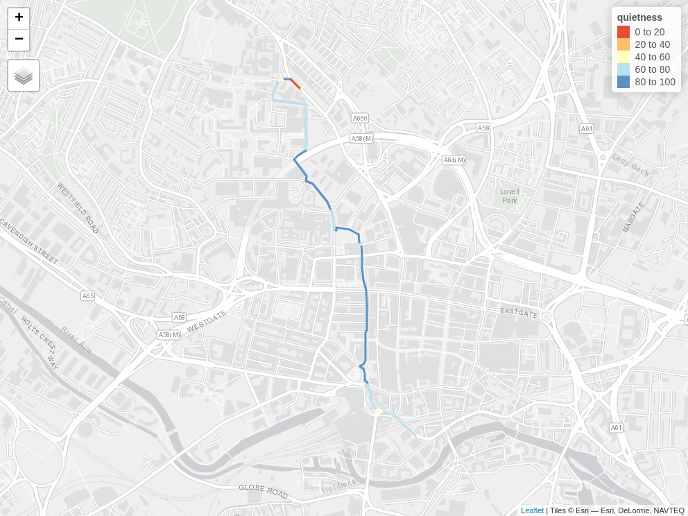
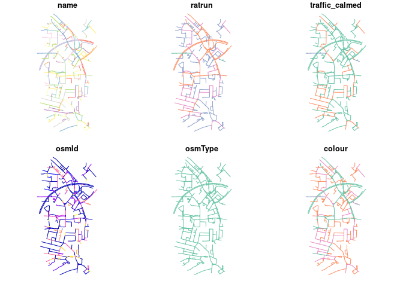

<!-- badges: start -->

[](https://github.com/cyclestreets/cyclestreets-r/actions)
[](https://CRAN.R-project.org/package=cyclestreets)
[](https://github.com/cyclestreets/cyclestreets-r/actions/workflows/R-CMD-check.yaml)
<!-- badges: end -->

<!-- README.md is generated from README.Rmd. Please edit that file -->

# cyclestreets

The goal of cyclestreets is to provide a simple R interface to the
CycleStreets routing service.

It was split-out from **stplanr** for modularity.

## Installation

You can install the released version of cyclestreets from
[CRAN](https://CRAN.R-project.org) with:

``` r
install.packages("cyclestreets")
```

Install the development version with **devtools** as follows:

``` r
# install.packages("devtools")
devtools::install_github("cyclestreets/cyclestreets-r")
```

## Example

A common need is to get from A to B:

``` r
library ("cyclestreets")
# stplanr::geo_code ("leeds rail station") 
from = c(-1.544, 53.794)
# stplanr::geo_code ("leeds university") 
to = c(-1.551, 53.807)
r = cyclestreets::journey(from, to, "balanced")
sf:::plot.sf(r)
#> Warning: plotting the first 10 out of 43 attributes; use max.plot = 43 to plot
#> all
```


To get a key go to <https://www.cyclestreets.net/api/apply/>

Save the key as an environment varible using
`export CYCLESTREETS=your_key_here` by adding
`CYCLESTREETS=your_key_here` as a new line in your `.Renviron` file,
e.g. with the following command:

``` r
usethis::edit_r_environ()
```

Check the map is good with leaflet:

``` r
library(leaflet)
p = colorNumeric("RdYlBu", domain = r$quietness, reverse = TRUE)
leaflet(r) %>% 
  addTiles() %>% 
  addPolylines(color = ~p(quietness), weight = 20, opacity = 0.9) %>% 
  addLegend(pal = p, values = ~quietness)
```

Or **tmap**, highlighting the recently added ‘quietness’ variable:

``` r
library(tmap)
tmap_mode("view")
tm_shape(r) + tm_lines("quietness", palette = "RdYlBu", lwd = 3)
```

    #> The legacy packages maptools, rgdal, and rgeos, underpinning the sp package,
    #> which was just loaded, will retire in October 2023.
    #> Please refer to R-spatial evolution reports for details, especially
    #> https://r-spatial.org/r/2023/05/15/evolution4.html.
    #> It may be desirable to make the sf package available;
    #> package maintainers should consider adding sf to Suggests:.
    #> The sp package is now running under evolution status 2
    #>      (status 2 uses the sf package in place of rgdal)
    #> Breaking News: tmap 3.x is retiring. Please test v4, e.g. with
    #> remotes::install_github('r-tmap/tmap')
    #> tmap mode set to interactive viewing
    #> Interactive map saved to /home/robin/github/cyclestreets/cyclestreets-r/m.html



See an interactive version of this map, showing all variables per
segment, [here](https://rpubs.com/RobinLovelace/784236).

Or **mapview**:

``` r
mapview::mapview(r)
```

Route types available are: fastest, quietest, balanced. See help pages
such as `?journey` and <https://www.cyclestreets.net/api/> for details.

You can also get streets by LTN status.

``` r
network_ltns = ltns(r)
plot(network_ltns)
```


