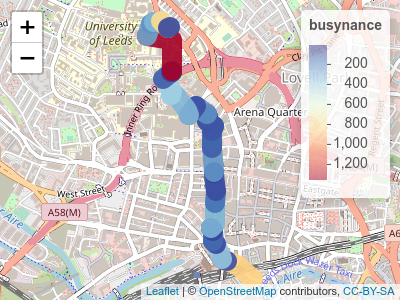

[](https://ci.appveyor.com/project/robinlovelace/cyclestreets)

<!-- README.md is generated from README.Rmd. Please edit that file -->
cyclestreets
============

The goal of cyclestreets is to provide a simple R interface to the CycleStreets.net routing service.

It was split-out from **stplanr** for modularity.

Installation
------------

<!-- You can install the released version of cyclestreets from [CRAN](https://CRAN.R-project.org) with: -->
Install the package with **devtools** as follows:

``` r
# install.packages("devtools")
devtools::install_github("Robinlovelace/cyclestreets")
```

Example
-------

A common need is to get from A to B:

``` r
library ("cyclestreets")
# stplanr::geo_code ("leeds rail station") 
from = c(-1.544, 53.794)
# stplanr::geo_code ("leeds university") 
to = c(-1.551, 53.807)
r = cyclestreets::journey(from, to, "balanced")
sf:::plot.sf(r)
```


To get a key go to <https://www.cyclestreets.net/api/apply/>

Save the key as an environment varible using `export CYCLESTREETS=your_key_here` by adding `CYCLESTREETS=your_key_here` as a new line in your `.Renviron` file, e.g. with the following command:

``` r
usethis::edit_r_environ()
```

Check the map is good with leaflet:

``` r
library(leaflet)
p = colorNumeric("RdYlBu", domain = r$busynance, reverse = TRUE)
leaflet(r) %>% 
  addTiles() %>% 
  addPolylines(color = ~p(busynance), weight = 20, opacity = 0.9) %>% 
  addLegend(pal = p, values = ~busynance)
```



Route types available are: fastest, quietest, balanced. See help pages such as `?journey` and <https://www.cyclestreets.net/api/> for details.
